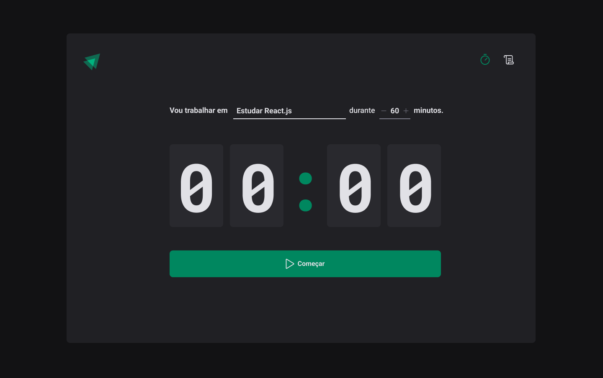
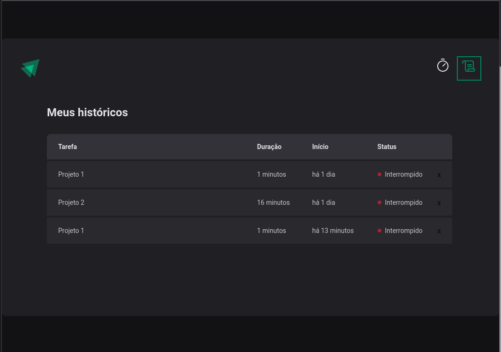

# Ignite Timer #

## Tela principal ##



## Tela de histórico ##



## Gerenciador de Tarefas com Temporizador ##

O Ignite Timer é uma aplicação desenvolvida com React.js, Vite.js e TypeScript, projetada para ajudar você a gerenciar suas tarefas e melhorar sua produtividade. Com recursos avançados e uma interface intuitiva, o Ignite Timer é a ferramenta ideal para manter o controle do tempo gasto em projetos e tarefas específicas.

## Recursos Principais ##

1. **Definição de Tarefas:** Crie tarefas facilmente, atribuindo um nome, uma estimativa de tempo e uma duração desejada.

2. **Acompanhamento de Status:** Mantenha-se informado sobre o status de suas tarefas - em andamento, concluídas ou interrompidas.

3. **Temporizador Integrado:** O Ignite Timer inclui um temporizador visual que exibe o tempo decorrido e o tempo restante para cada tarefa.

4. **Iniciar e Interromper:** Inicie e interrompa os temporizadores das tarefas com um simples clique, permitindo que você gerencie seu tempo de forma eficiente.

5. **Validação de Dados:** Utilizamos a biblioteca Zod para garantir que os dados inseridos sejam válidos e estejam de acordo com as regras definidas.

6. **Controle de Estado Imutável:** O Immer é utilizado para manter um estado imutável, tornando a manipulação de dados mais segura e eficiente.

7. **Manipulação de Datas:** O Date-fns é usado para lidar com datas e horários, garantindo que os temporizadores funcionem de forma precisa.

8. **Estilização Personalizada:** Utilizamos Styled-components para criar uma interface atraente e responsiva.

9. **Formulários Avançados:** O React Hook Form e o @hookform/resolvers são empregados para criar formulários flexíveis e com validação de dados em tempo real.

10. **Ícones Personalizados:** Incorporamos ícones do conjunto Phosphor-React para uma experiência de usuário visualmente agradável.

## Instruções para Execução Local ##

Para testar o Ignite Timer em sua própria máquina, siga os passos abaixo:

1. Clone o repositório do projeto a partir do GitHub:

   ```bash
   git clone https://github.com/seu-usuario/02-ignite-timer.git
   ```

2. Navegue até a pasta do projeto:

   ```bash
   cd 02-ignite-timer
   ```

3. Instale as dependências usando npm, pnpm ou yarn. Escolha um dos comandos abaixo com base no seu gerenciador de pacotes preferido:

   - Usando npm:

     ```bash
     npm install
     ```

   - Usando pnpm:

     ```bash
     pnpm install
     ```

   - Usando yarn:

     ```bash
     yarn install
     ```

4. Após a instalação das dependências, inicie a aplicação localmente:

   ```bash
   npm run dev
   ```

   Ou, se você estiver usando pnpm ou yarn:

   ```bash
   pnpm run dev
   ```

   ```bash
   yarn dev
   ```

5. Abra seu navegador e acesse a seguinte URL:

   ```bash
   http://localhost:3000
   ```

Agora, você pode começar a usar o Ignite Timer para gerenciar suas tarefas e otimizar sua produtividade. Aproveite!
